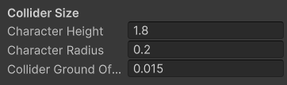

# Character Movement Settings


You must create a [Character Variant](../quick-configuration.md) for changes to be applied.


### Collider Size

Control the Box Collider of the character

<figure><figcaption></figcaption></figure>

**Character Height -** Vertical size of the character hitbox.

**Character Radius -** Half of the character hitbox width.

**Collider Ground Offset -** The height at which the character hitbox should be off the ground.

***

### Movement

Core variables for moving the character

<figure><figcaption></figcaption></figure>

**Only Sprint Forward** - If checked, players will only be able to sprint if their velocity is moving forward.

**Use Acceleration Movement** - Toggle between Instant Motion and Acceleration Motion. Instant Motion drives the character instantly to the target speed. Acceleration Motion will move the character with a force over time.

**Speed** - Desired speed to move while the character is jogging. Will instantly move to this in Instant Motion mode or stop the acceleration when it reaches this speed. Measured in meters per second.

**Sprint Speed** - Same as speed but while sprinting.

**Acceleration Force** - How fast to accelerate while in Acceleration Mode. Also controls acceleration when your character is moving faster than the target speed (ie. being flung into the air by a spring). In meters per second.

**Sprint Acceleration Force** - same as Acceleration Force but while sprinting.

**Min Acceleration Delta** - When moving faster than your target speed, your acceleration will be dampened if you try to acceleration in the direction you are moving. This value is a normalized minimum amount that you can move in a direction you are already moving.

**In Air Direction Control** - How much control do you have over movement while in the air? 0 is no control, 1 is full control just like on the ground.

**Acceleration Turn Friction -** An experimental force that makes changing directions stop your forward momentum as if the character has to plant their feet to turn.

***

### Crouching

Specific modifiers for the crouching state

<figure><figcaption></figcaption></figure>

**Auto Crouch -** Makes the character crouch if they walk into a small area.

**Prevent Falling While Crouched -** While crouching, prevent falling off ledges.

**Prevent Step Up While Crouched -** While crouching, don't step up onto ledges.

**Crouch Speed Multiplier -** Crouching speed is determined by multiplying the speed against this number.

**Crouch Height Multiplier -** Character height multiplier when crouching (e.g. 0.75 would be 75% of normal character height).

***

### Jump

Modifiers to how the character jumps

<figure><figcaption></figcaption></figure>

**Number Of Jumps -** How many jumps you can make before hitting the ground again.

**Jump Speed -** Upward velocity applied to character when player jumps.

**Jump Coyote Time -** The time after falling that the player can still jump.

**Jump Up Block Cooldown -** Minimum interval (in seconds) between jumps, measured from the time the player became grounded.

***

### Flying

Modifiers to how the flying mode works

<figure><figcaption></figcaption></figure>

**Allow Debug Flying -** Let console commands toggle flying (/fly from chat).

**Fly Speed Multiplier -** Flying speed is determined by multiplying the speed against this number.

**Vertical Fly Speed -** How fast the character can move up and down while flying.

***

### Gravity

How gravity affects this character

<figure><figcaption></figcaption></figure>

**Use Gravity -** Apply Physics.gravity force every tick.

**Use Gravity While Grounded -** Apply gravity even when on the ground for accurate physics.

**Always Snap to Ground -** When grounded force the Y position of the character to the found ground plane.

**Gravity Multiplier -** Multiplier of global gravity force.

**Upwards Gravity Multiplier -** Use this to adjust gravity while moving in the +Y. So you can have floaty jumps upwards but still have hard drops downward.

***

### Physics

How world physics affect this character

<figure><figcaption></figcaption></figure>

**Ground Collision Layer Mask -** What layers will count as walkable ground.

**Terminal Velocity -** Maximum fall speed, measured in meters per second.

**Minimum Velocity -** Velocity will be set to zero when below this threshold on the ground.

**Use Minimum Velocity in Air -** Also stop momentum when in the air.

**Prevent Wall Clipping -** Push the character away from walls to prevent rigidbody friction and unwanted collision overlaps.

**Drag -** Drag coefficient.

**Air Drag Multiplier -** How much to multiply drag resistance while you are in the air.

**Air Speed Multiplier -** How much to multiply speed while you are in the air.

**Additional No Input Drag -** How much to decelerate when no input is given in the air at a per second rate.

**Air Input Acceleration -** How fast your player will accelerate in the air from player input at a per second rate.

***

### Step Ups

Configuration for stepping onto ledges

<figure><figcaption></figcaption></figure>

**Detect Step Ups -** Push the character up when they stop over a set threshold.

**Always Step Up -** Step the character up every frame if it there's nothing to push up to.

**Assisted Ledge Jump -** While in the air, if you are near an edge it will push you up to the edge. Requires detectStepUps to be on.

**Max Step Up Height -** How high in units can you auto step up.

**Step Up Ramp Distance -** How far away to check for a step up.

***

### Slopes

Configuration for walking along sloped surfaces

<figure><figcaption></figcaption></figure>

**Detect Slopes -** Auto detect slopes to create a downward drag. Disable as an optimization to skip raycast checks.

**Slope Force -** The maximum force that pushes against the character when on a slope.

**Min Slope Delta -** Slopes below this threshold will be ignored. 0 is flat ground, 1 is a vertical wall.

**Max Slope Delta -** Slopes above this threshold will be treated as walls.
