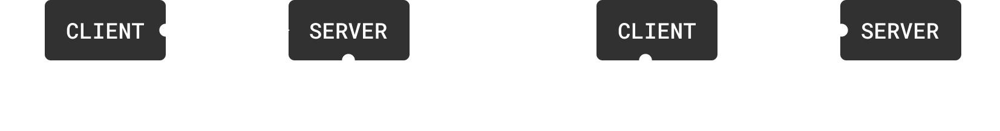

# Network Functions

## Network Functions

Network Functions allow for two-way client to server communication and follow a request and response format.

<figure><figcaption><p>Network Functions</p></figcaption></figure>

## Overview

An example of when a `RemoteFunction` would be appropriate is a player requesting to open a loot crate. First the player tells the server the kind of crate it would like to open, and the server responds with what the player received.


```typescript
interface CrateResponse {
    item: string;
    rarity: string;
}

export default class CrateManager extends AirshipSingleton {
    // Creating a NetworkFunction
    private open =
        new NetworkFunction<{ crateType: string }, CrateResponse>("LootCrate");

    public override Start(): void {
        if (Game.IsClient()) {
            // Tell the server that you'd like to open a loot crate
            const loot = this.open.client.FireServer({ crateType: "weapon" });
            print(`You received a ${loot.rarity} ${loot.item}`);
        }

        if (Game.IsServer()) {
            // Listen for player crate open requests
            this.openCrate.server.SetCallback((player, event) => {
                return {
                    item: "sword",
                    rarity: "legendary",
                }
            });
        }
    }
}
```


***

#### Example Use Cases



<table><thead><tr><th>Example</th><th>Explanation</th><th data-hidden></th></tr></thead><tbody><tr><td>Purchase Request</td><td>Client requests to purchase an item, server validates the transaction, client is notified of the result</td><td></td></tr></tbody></table>



<table><thead><tr><th width="350">Example</th><th></th><th data-hidden></th></tr></thead><tbody><tr><td>Prompt Popup</td><td>Server notifies client of a game event, a prompt pops up on client allowing them to choose if they would like to participate, player responds with "Yes" or "No" and server is informed of result</td><td></td></tr></tbody></table>



### Creating a Network Function

Like [Network Signals](network-signals.md), Network Functions can be created inside of any script. A `NetworkFunction` expects two generic parameters: a request type and response type.


```typescript
interface CrateResponse {
    item: string;
    rarity: string;
}

const openCrate = 
    new NetworkFunction<{ crateType: string }, CrateResponse>("LootCrate");
```


***

### Client -> Server -> Client

Firing a Network Function on the client


```typescript
const loot = openCrate.client.FireServer({ crateType: "weapon" });
print(`You received a ${loot.rarity} ${loot.item}`);
```


Listening to Network Functions on the server


```typescript
openCrate.server.SetCallback((player, event) => {
    return {
        item: "sword",
        rarity: "legendary",
    };
});
```


`SetCallback`'s first parameter is always the [`Player`](https://ref.airship.gg/classes/Player.html) who fired the network function.

***

### Server -> Client -> Server

Network Functions that originate on the server behave exactly the same.


`NetworkFunctions` are synchronous, the active thread will **yield** until the callback returns. Consider wrapping `FireServer` and `FireClient` calls inside of [`task.spawn`](https://ref.airship.gg/functions/task.spawn.html) to avoid interfering with the flow of your game.

