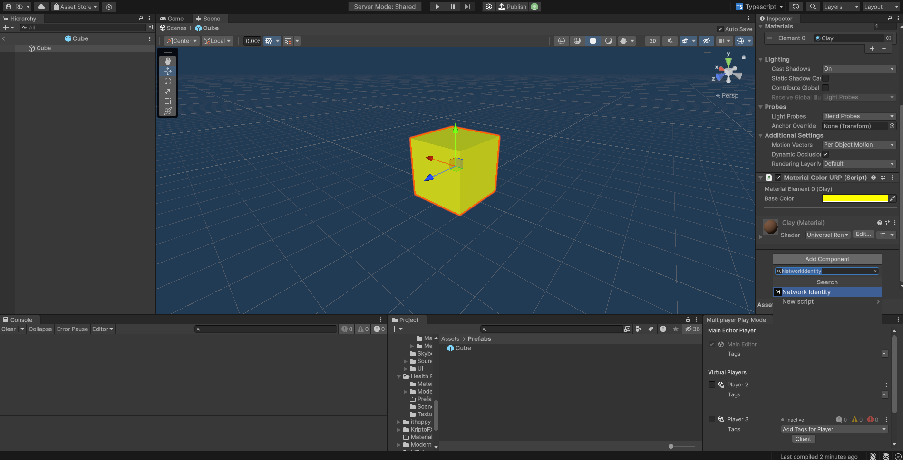
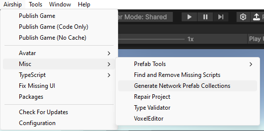
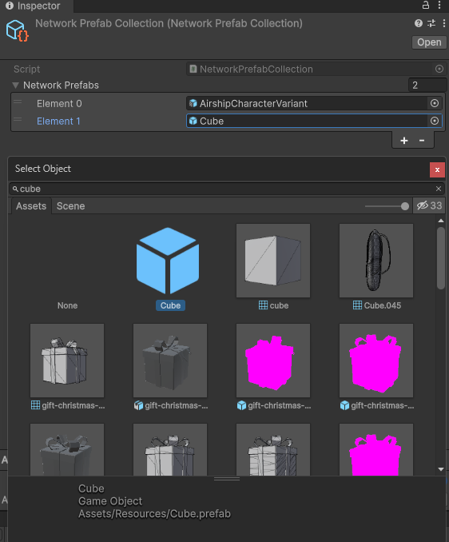

# Network Identity

The [NetworkIdentity](network-identity.md#networkidentity) component enables you to spawn `GameObjects` on the server and have them automatically appear on each client.

***

## Overview


```typescript
export default class CubeManager extends AirshipSingleton {
    // This is a reference to a prefab with a NetworkIdentity component
    public Cube: GameObject;

    public override Start(): void {
        if (Game.IsServer()) {
            // Spawn a cube on the server and replicate it to each player
            const cube = Object.Instantiate(
                this.Cube, 
                new Vector3(0, 1, 0), 
                Quaternion.identity
            );
            NetworkServer.Spawn(cube);
            // Despawn cube after 4 seconds
            task.delay(4, () => NetworkServer.Destroy(cube));
        }
    }
}
```



Spawning and despawning a NetworkIdentity


## NetworkIdentity

### Attaching a NetworkIdentity Component

The `NetworkIdentity` component can be added to any [`GameObject`](https://docs.unity3d.com/ScriptReference/GameObject.html) through the "Add Component" menu.

<figure><figcaption><p>Adding a NetworkIdentity component to a prefab</p></figcaption></figure>

***

### Adding a NetworkIdentity to a NetworkPrefabCollection

In order to be able to spawn and despawn a `NetworkIdentity` through code, it must be a part of a game's NetworkPrefabCollection. The template project includes a collection in the `Assets/Resources` folder.

If your project does **not** already contain a collection, you can automatically generate one through the "Generate Network Prefab Collections" menu item.

<figure><figcaption><p>Generating a NetworkPrefabCollection</p></figcaption></figure>


When a NetworkPrefabCollection is generated, it is automatically populated with every prefab in the project that contains a [NetworkIdentity](network-identity.md#networkidentity).  For smaller projects, this tool can be used to entirely manage a game's collection. If a game has a large amount of assets, developers should opt to manually add new prefabs to their game's collection.


To add a `NetworkIdentity` to your game's NetworkPrefabCollection, drag a prefab from your Hierarchy or Project tab onto the NetworkPrefabCollection "Network Prefabs" list, or select the prefab through the search menu.

<figure><figcaption><p>Adding a prefab to a NetworkPrefabCollection</p></figcaption></figure>

***

### Spawning a NetworkIdentity


```typescript
const cube = Object.Instantiate(cubePrefab);
NetworkServer.Spawn(cube);
```



When a player joins a game all networked `GameObjects` in the server scene are automatically replicated to the player.


***

### Despawning a NetworkIdentity


```typescript
NetworkServer.Destroy(cube);
```


***

### Sending a NetworkIdentity over network

You can use `networkIdentity.netId` to send a reference to a NetworkIdentity via NetworkSignals and NetworkFunctions.

Use `NetworkUtil.GetNetworkIdentity(netId)` to retrieve a NetworkIdentity from the netId.&#x20;
