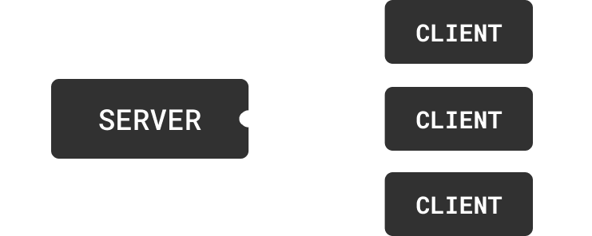

# Network Signals

[Network Signals](network-signals.md#network-signals) are used to communicate between the client and server. They are a critical piece of building a multiplayer game.&#x20;

***

## Overview

Imagine a scenario where a player would like to use a health potion. We first need to tell the server that a player would like to use a potion and have it apply the potion's effects.


```typescript
export default class PotionManager extends AirshipSingleton {
    // Creating a NetworkSignal
    private usePotion = new NetworkSignal<{ potion: string }>("UsePotion");

    public override Start(): void {
        if (Game.IsClient()) {
            // Tell the server that the local player is trying to use a potion
            this.usePotion.client.FireServer({ potion: "health" });
        }

        if (Game.IsServer()) {
            // Listen for a player use potion request
            this.usePotion.server.OnClientEvent((player, event) => {
                const hasPotion = DoesPlayerHavePotion(player, event.potion);
                if (!hasPotion) return;
                // Apply the potion's effect
                player.character?.SetHealth(100);
            });
        }
    }
}
```


***

## Network Signals

#### Example Use Cases



<table><thead><tr><th>Example</th><th>Explanation</th><th data-hidden></th></tr></thead><tbody><tr><td>Ability Use</td><td>Notifying the server when a player uses a special ability</td><td></td></tr><tr><td>Trade Request</td><td>Letting the server know two players would like to trade</td><td></td></tr><tr><td>Item Drop</td><td>Telling the server a player has dropped an item</td><td></td></tr></tbody></table>



| Example             | Explanation                                                                    |
| ------------------- | ------------------------------------------------------------------------------ |
| Weather Change      | Informing clients of a weather change to keep them visually synchronized       |
| Leaderboard Updates | Letting clients know the latest leaderboard standings                          |
| Status Effects      | Communicating that a client has had a status effect applied to their character |



### Creating a Network Signal

Network Signals can be created inside of any script. `NetworkSignal` takes a single generic parameter that is the type of data passed through the signal.

<pre class="language-typescript" data-title="Shared" data-line-numbers data-full-width="false"><code class="lang-typescript"><strong>const usePotion = new NetworkSignal&#x3C;{ potion: string }>("UsePotion");
</strong></code></pre>


The `NetworkSignal` constructor accepts a single `string` parameter that uniquely identifies the signal. Providing a string that is already in use will raise an error when entering play mode.


***

### Client -> Server

<figure><figcaption><p>Network Signal: Client -> Server</p></figcaption></figure>

Firing the `usePotion` Network Signal on the client


```typescript
usePotion.client.FireServer({ potion: "health" });
```


Listening for `usePotion` Network Signals on the server


```typescript
usePotion.server.OnClientEvent((player, event) => {
    print(`${player.username} is using potion: ${event.potion}`);
});
```


The first argument passed to `OnClientEvent` is always the [`Player` ](https://ref.airship.gg/classes/Player.html)who fired the Network Signal.

***

### Server -> Client

<figure><figcaption><p>Network Signal: Server -> Client(s)</p></figcaption></figure>

Once the server has applied the potion, we want to tell every player about it so they can play particle effects, sounds, update UI, etc.

Server to client Network Signals can be sent to any number of players


```typescript
const potionUsed 
    = new NetworkSignal<{ userId: string; potion: string }>("PotionUsed");
```


Telling all players a potion has been consumed


```typescript
potionUsed.server.FireAllClients({ userId: "1", potion: "health" });
```


Listening for `potionUsed` Network Signals on the client


```typescript
potionUsed.client.OnServerEvent((event) => {
    print(`User ${event.userId} has used potion: ${event.potion}`);
});
```


***

## Data Limitations

Primitive data types and their composite forms (arrays, objects) can be sent over the network when using `NetworkSignals` and `NetworkFunctions`.  The following Unity types are also supported

* [Vector3](https://docs.unity3d.com/ScriptReference/Vector3.html)
* [Vector2](https://docs.unity3d.com/ScriptReference/Vector2.html)
* [Quaternion](https://docs.unity3d.com/ScriptReference/Quaternion.html)
* [Color](https://docs.unity3d.com/ScriptReference/Color.html)


A common requirement is sending Characters and Players over the network. Send [Player ](https://ref.airship.gg/classes/Player.html)and [Character](https://ref.airship.gg/classes/Character.html) ids and utilize the [Player](https://ref.airship.gg/classes/PlayersSingleton.html) and [Character](https://ref.airship.gg/classes/CharactersSingleton.html) APIs to fetch their respective objects. This ensures that only permitted data types are sent over the network, while the actual player and character objects are retrieved locally.


## Caching

If a network signal receives an event, but does not have any existing connection handlers, the event will be cached until the first connection is created. At this point, all events will be passed along to the connection handler.

This is typically useful when the server sends a client a network signal event right after the client has joined, but before the client has connected to the signal. Thus, the event is not missed by the client, as it is successfully handed to the first connection to the signal on the client.

The cache is limited in size (currently hard-coded to 10,000), and will throw errors if exceeded.
