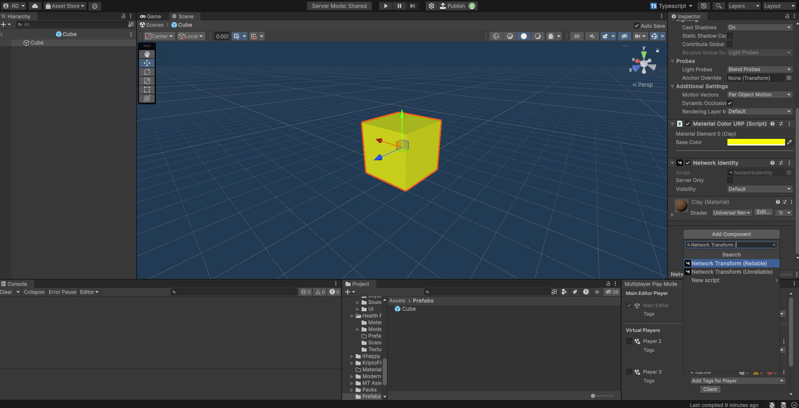

# Network Transform

The NetworkTransform component allows you to position, rotate, and scale GameObjects on the server and have the changes automatically applied on each player's client.

***

## Overview


```typescript
export default class CubeManager extends AirshipSingleton {
    // This is a reference to a prefab with NetworkIdentity and NetworkTransform
    // components
    public Cube: GameObject;
    // This is a reference to an instantiated cube
    private cubeInstance?: GameObject;

    public override Start(): void {
        if (!Game.IsServer()) return;
        // Spawn a cube on the server
        this.cubeInstance = Object.Instantiate(
            this.Cube, 
            new Vector3(0, 1, 0), 
            Quaternion.identity
        );
        NetworkServer.Spawn(this.cubeInstance);
    }

    public override Update(dt: number): void {
        if (!Game.IsServer() || !this.cubeInstance) return;
        // Rotate the cube on the server
        this.cubeInstance.transform.Rotate(Vector3.up, 10 * dt);
    }
}
```



Using a NetworkTransform to rotate a GameObject


***

## NetworkTransform

### Attaching a NetworkTransform Component

The `NetworkTransform` component can be added to any [`GameObject`](https://docs.unity3d.com/ScriptReference/GameObject.html) through the "Add Component" menu.

<figure><figcaption><p>Adding a NetworkTransform component to a prefab</p></figcaption></figure>


`NetworkTransform` requires a [NetworkIdentity ](network-identity.md)component to function properly.


***

### Network Ownership

When you spawn a NetworkIdentity, you can optionally specify an owner. The player who has ownership of a NetworkIdentity with a [NetworkTransform](network-transform.md#networktransform) component has the authority to control the [Transform](https://docs.unity3d.com/ScriptReference/Transform.html) of the parent GameObject. All Transform updates made by the owner are applied on the server, and then sent to and applied on every other player's client.


```typescript
NetworkServer.Spawn(
    this.cubeInstance,
    player.networkIdentity.connectionToClient
);
```


On the owner player's client


```typescript
cube.transform.position = new Vector3(0, 10, 0);
```


This is particularly useful when you want a player to be able to control a non-player entity, such as a spaceship, turret, or a vehicle.
