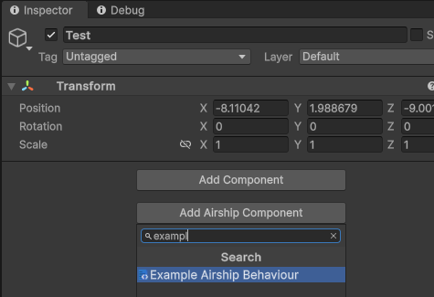
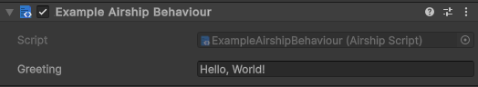

# AirshipBehaviour

Most game logic is run through AirshipBehaviours. It is our equivalent to [Unity's MonoBehaviour](https://docs.unity3d.com/Manual/class-MonoBehaviour.html).

AirshipBehaviours offer useful lifecycle methods. They are attached to [Game Objects](https://docs.unity3d.com/Manual/class-GameObject.html).&#x20;


```typescript
export default class ExampleAirshipBehaviour extends AirshipBehaviour {
	public greeting = "Hello, World!";

	public Start(): void {
		print(this.greeting);
	}
}
```


After the file is compiled, it can be added to a Game Object through the **Add Airship Component** menu

<figure><figcaption></figcaption></figure>

You should see your component added after selecting it:

<figure><figcaption></figcaption></figure>

When you run your game, this will print "Hello, World!"&#x20;
