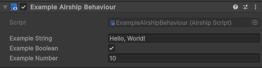
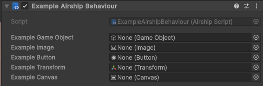
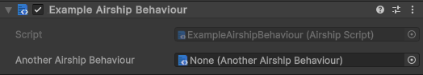
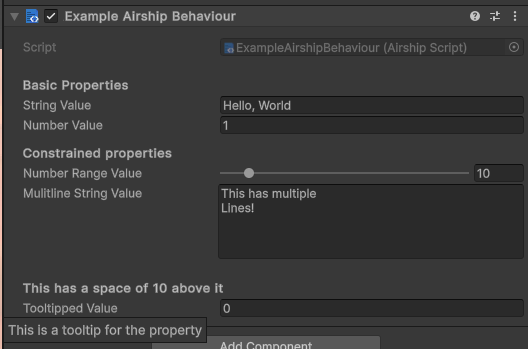

# Adding Inspector Properties

## Adding properties to your component

Any `public` marked property that is a valid serializable type in Unity will show up in the inspector for an `AirshipBehaviour` component

```typescript
export default class ExampleAirshipBehaviour extends AirshipBehaviour {
	public exampleString = "Hello, World!";
	public exampleBoolean = true;
	public exampleNumber = 10;
}
```

<figure><figcaption><p>Woo, properties!</p></figcaption></figure>

If you do not want your properties exposed, you can just specify them as `private` or `protected`. You can also use the `@NonSerializable` attribute decorator (and use `@SerializeField` to show private/protected fields to the inspector!)

### Adding references to Unity and Airship components

You can add references to Unity Objects in the same way as values. If you might not attach a reference in the inspector you should define it as optional with a `?`

<pre class="language-typescript"><code class="lang-typescript"><strong>export default class ExampleAirshipBehaviour extends AirshipBehaviour {
</strong><strong>	// Assume these will be set in inspector
</strong>	public exampleGameObject: GameObject;
	public exampleImage: Image;
	public exampleButton: Button;
	
	// Possibly not set in inspector
	public exampleTransform?: Transform;
	public exampleCanvas?: Canvas;
}
</code></pre>

<figure><figcaption><p>References to unity objects - nice!</p></figcaption></figure>


when referencing an object for Instantiation you must use a Game Object reference. You are not able to directly reference a component until it is instantiated in the scene.&#x20;


#### Adding AirshipBehaviour reference properties

Just like our Unity Object references, we can also add references to other `AirshipBehaviour` components. Any defined class that extends `AirshipBehaviour` can be used as a reference.

```typescript
import AnotherAirshipBehaviour from "./AnotherAirshipBehaviour";

export default class ExampleAirshipBehaviour extends AirshipBehaviour {
	public anotherAirshipBehaviour!: AnotherAirshipBehaviour;
}
```

<figure><figcaption><p>References to another AirshipBehaviour!</p></figcaption></figure>

### Organizing your properties

You can use attributes to stylize our inspector properties using decorators:

```typescript
export default class ExampleAirshipBehaviour extends AirshipBehaviour {
	@Header("Basic Properties")
	public stringValue = "Hello, World";
	public numberValue = 1;

	@Header("Constrained properties")
	@Range(0, 100) // show a range of 0 to 100 in the inspector
	public numberRangeValue = 10;

	@Multiline(5) // The number here is the number of lines, and is optional
	public mulitlineStringValue = "This has multiple\nLines!";

	@Spacing(10) // Create some extra space before the next section
	@Header("This has a space of 10 above it")
	@Tooltip("This is a tooltip for the property") // explicit tooltips
	public tooltippedValue = 0;
}
```

<figure><figcaption></figcaption></figure>

### JSDoc Tooltips

In Airship we support _implicit JSDoc_ tooltips - which are generated by JSDoc comments:


**NOTE**:  JSDoc Code blocks, inline code blocks, tables, hyperlinks and images are not supported in the editor and will not show up in the tooltips.


```typescript
export default class ExampleBehaviour extends AirshipBehaviour {
	/**
	 * A value that's documented by JSDoc
	 */
	public value = 100;
}
```

Not only does this have the benefit of being documented in your editor:

<figure><figcaption><p>The JSDoc tooltip in the editor</p></figcaption></figure>

But Airship will also generate a tooltip in-editor with the same formatting:

<figure><figcaption><p>The tooltip generated in the editor</p></figcaption></figure>

Examples of formatting in the tooltips:

```typescript
export default class ExampleBehaviour extends AirshipBehaviour {
	/**
	 * ## This is a heading
	 * **Some bold** and _italicized_ text.
	 *
	 * - List item 1
	 * - List item 2
	 */
	public value = 100;
}
```

<figure><figcaption><p>Formatted tooltips, just like in the code editor!</p></figcaption></figure>
