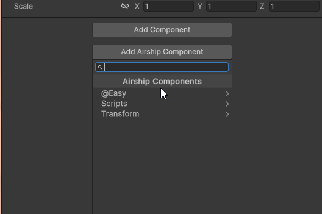

# Using Component Decorators

Just like with `MonoBehaviour` in Unity, with our `AirshipBehaviour` we can customize a few things

## Customizing the component menu path

In regular Unity, there is the [`AddComponentMenu`](https://docs.unity3d.com/ScriptReference/AddComponentMenu.html) attribute, in Airship it's the `AirshipComponentMenu` decorator.&#x20;

This is useful for organization purposes.

```typescript
@AirshipComponentMenu("Transform/Follow Transform")
export default class FollowTransform extends AirshipBehaviour {
}
```

<figure><figcaption><p>Instead of being in the <code>Scripts</code> menu, now it's in <code>Transform</code> :)</p></figcaption></figure>

## Customizing the Icon

By default an `AirshipComponent` has the `AirshipScript` icon - however this can be changed as like with `MonoBehaviour` scripts

This is done through the `AirshipComponentIcon` decorator. The path should point to a texture in your project.

```typescript
@AirshipComponentMenu("Voyager/Voyager Health")
@AirshipComponentIcon("Assets/Editor/Icons/Health.png")
export default class VoyagerHealthComponent extends AirshipBehaviour {
    // ... code here
}
```

<figure><figcaption><p>Note the <em>Heart</em> icon, also the custom title from the component menu</p></figcaption></figure>
